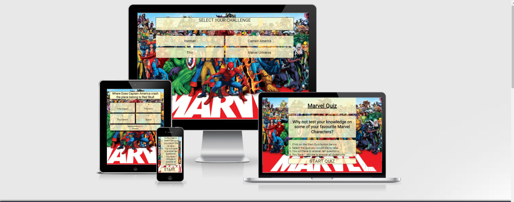

# Owen McGill_5P

## Full-Stack Development Course | Portfolio Project 2

View the live project here.

The purpose of this site is to give the visitor a fun interactive quiz. This web application would be for anyone but especially any one how is a fan of the Marvel Universe. This is a place they can test there knowledge on some of there favourite characters annd see how much they really know. 

## User Experience (UX)

-   ### User stories

    -   #### First Time Visitor Goals

        1. As a First Time Visitor, I want to easily understand the main purpose of the site.
        2. As a First Time Visitor, I want to be able to easily navigate throughout the site to find content.
        

-   ### Design
    -   #### Colour Scheme
        -   The three main colours i used are blue black and white. I keep the colour scheme simple as not to take away from the photos of the consoles. Most of the photos have a white background and the console's them selves are mainly black and white in colour. The background colour has a gradient of light blue to dark blue so when the user is scrolling down through the page its not just the same block colour. 

    -   #### Typography
        -   The Roboto font is the main font used throughout the whole website with Sans Serif as the fallback font in case for any reason the font isn't being imported into the site correctly. Roboto is a clean font used frequently in programming, so it is both attractive and appropriate.
    
   ### Wireframes

- The wireframes for the project can be found here [Wireframe](/workspace/p2-marvel-quiz/assets/wireframes)

 

## Features

-   Responsive on all device sizes

### Languages Used

-   [HTML5](https://en.wikipedia.org/wiki/HTML5)
-   [CSS3](https://en.wikipedia.org/wiki/Cascading_Style_Sheets)
-   [JAVASCRIPT](https://en.wikipedia.org/wiki/JavaScript)

### Frameworks, Libraries & Programs Used

1. [Balsamiq:](https://balsamiq.com/) This was used to create the wireframes for the project.
   

## Testing

The W3C Markup Validator and W3C CSS Validator Services were used to validate every page of the project to ensure there were no syntax errors in the project.

-   [W3C Markup Validator](https://jigsaw.w3.org/css-validator/#validate_by_input) - 
-   [W3C CSS Validator](https://jigsaw.w3.org/css-validator/#validate_by_input) - 
### Testing User Stories from User Experience (UX) Section

-   #### First Time Visitor Goals

-   Upon entering the site, users are automatically greeted with a clean and easily readable navigation bar to go to the page of their choice.

-   The user has two options from the home page use the navigation bar at the top of the page or click the logo for the console they want to find out more about.

-   When they get to the console page they are looking for they can scroll down and through them or there is a sub menu bar to take them straight to there console of choice.

### Testing

-   The Website was tested on Google Chrome, Internet Explorer, Microsoft Edge and Safari browsers.
-   The website was viewed on a variety of devices such as Desktop, Laptop, iPhone7, iPhone 8 & iPhoneX.
-   A large amount of testing was done to ensure that all pages were linking correctly.
-   Friends and family members were asked to review the site and documentation to point out any bugs and/or user experience issues.

## Development

-   Further development of this site would include adding more companys and there consoles.

-   Adding a gaming hand held section.

-   Include a section for fixs for common know issues.

-   Include tear down videos for cleaning and restoring vintage consoles and hand helds.   

### Deployment

-    The website was deployed to Github pages.

      1. From the Github repository go to 'Settings'.

      2. From there navigate to the section 'Pages'.

      3. From the dropdown menu in the section labeled 'Source' choose the option 'Master Branch' and click 'Save'.

      4. Once saved a notification informing you the site has been published will appear with a link to the website.

### Making a local Clone

-    Steps to clone this repositiory.

       1. On GitHub go to the main page of the Repository.

       2. Above the list of files click the code menu with the drop down arrow.

       3. To clone the repository using HTTPS, under "Clone with HTTPS", click on the clipboard.

       4. Open the Git Bash ternimal.

       5. Change the current working directory to the location where you want the cloned directory.

       6. Type git clone, and then paste the URL you copied earlier from step 3.

       7. Press Enter to create your local clone.

####    To troubleshoot any problems in cloning please go to GitHub pages for more help. [GitHub](https://docs.github.com/en/github/creating-cloning-and-archiving-repositories/cloning-a-repository-from-github/cloning-a-repository#troubleshooting-cloning-errors)

### Code

-  The background were sourced using [CSS Gradient](https://cssgradient.io/) 

### Content

-   All Console information was sourced using [Wikipedia](https://www.wikipedia.org/)

-   All of the videos were sourced from [Youtube](www.youtube.com)

### Media

-  Photos were sourced from wedsite's with free lisence file can be found here [IMAGES](https://github.com/newo88/p1console-origin/blob/master/docs/photos_p1.txt.odt)

### Acknowledgements

-   My Mentor Chris for continuous helpful feedback and advice.

